# Hotel Booking Management System - Architecture Diagram

## System Overview

```mermaid
graph TB
    %% External Layer
    Client[👤 Web Client]
    Browser[🌐 Browser]

    %% Frontend Layer
    WebApp[📱 WebApp Service]

    %% API Gateway Layer
    Gateway[🚪 Gateway Service]

    %% Core Services Layer
    BookingMgmt[📋 Booking Management]
    Booking[🏨 Booking Service]
    Admin[👔 Admin Service]
    Payments[💳 Payments Service]

    %% Background Services
    Worker[⚙️ Worker Service]

    %% Data Layer
    PostgresDB[(🐘 PostgreSQL)]
    MySQL[(🐬 MySQL)]
    Kafka[(📨 Apache Kafka)]

    %% Client Interactions
    Client --> Browser
    Browser --> WebApp
    WebApp --> Gateway

    %% Gateway Routing
    Gateway --> BookingMgmt
    Gateway --> Booking
    Gateway --> Admin

    %% Service Dependencies
    BookingMgmt --> PostgresDB
    Booking --> Kafka
    Booking --> Payments
    Admin --> MySQL
    Worker --> PostgresDB
    Kafka --> Worker

    %% Data Validation
    Booking -.->|Validate Bookings| BookingMgmt

    %% Styling
    classDef frontend fill:#e1f5fe,stroke:#0277bd,stroke-width:2px
    classDef gateway fill:#f3e5f5,stroke:#7b1fa2,stroke-width:2px
    classDef service fill:#e8f5e8,stroke:#2e7d32,stroke-width:2px
    classDef database fill:#fff3e0,stroke:#f57c00,stroke-width:2px
    classDef messaging fill:#fce4ec,stroke:#c2185b,stroke-width:2px
    classDef client fill:#f1f8e9,stroke:#558b2f,stroke-width:2px

    class Client,Browser client
    class WebApp frontend
    class Gateway gateway
    class BookingMgmt,Booking,Admin,Payments,Worker service
    class PostgresDB,MySQL database
    class Kafka messaging
```



## Service Communication Patterns

### 1. Request-Response Flow


### 2. Event-Driven Flow


## Data Architecture

### Database Schemas


## Event Schema

### Kafka Topics and Events

```mermaid
graph LR
    subgraph "Kafka Topics"
        BE[📬 booking-events]
        BC[📬 booking-cancellations]
    end

    subgraph "Event Producers"
        BS[Booking Service]
    end

    subgraph "Event Consumers"
        WS[Worker Service]
    end

    BS -->|Booking Created| BE
    BS -->|Booking Cancelled| BC
    BE --> WS
    BC --> WS
```


### Event Payloads
```json
{
  "booking-events": {
    "userId": "user_123",
    "roomId": "room_ocean_001",
    "guests": 2,
    "startDate": "2025-01-15T15:00:00Z",
    "endDate": "2025-01-18T11:00:00Z",
    "bookingId": "booking_456",
    "paymentId": "pay_789"
  },
  "booking-cancellations": {
    "bookingId": "booking_456",
    "userId": "user_123",
    "timestamp": "2025-01-18T10:30:00Z"
  }
}
```

## Technology Stack

### Frontend Layer
- **React 18** with TypeScript
- **React Router DOM** for navigation
- **Axios** for HTTP requests
- **Nginx** for production serving

### API Gateway
- **Go 1.24** with Gorilla Mux
- **Reverse Proxy** pattern
- **CORS handling** and SSL termination

### Backend Services
- **Go Services**: booking-management, booking, worker
- **Node.js Services**: admin, payments
- **REST APIs** with structured logging
- **Distributed tracing** with baggage headers

### Data Layer
- **PostgreSQL**: Primary data store (users, rooms, bookings)
- **MySQL**: Admin data (employees, complaints)
- **Apache Kafka**: Event streaming and messaging

### Infrastructure
- **Docker & Docker Compose**: Containerization
- **Okteto**: Cloud development platform
- **Health Checks**: Service readiness verification

## Security & Observability

### Security Features
- Input validation across all services
- SQL injection prevention (prepared statements)
- CORS configuration
- SSL/TLS support with certificate handling
- Non-root Docker containers

### Monitoring & Logging
- Health check endpoints on all services
- Structured JSON logging
- Distributed tracing with baggage propagation
- Service dependency health monitoring
- Real-time system status dashboard

## Deployment Patterns

### Development
```bash
# Local development with Docker Compose
docker-compose up -d

# Cloud development with Okteto
okteto deploy --remote
okteto up [service-name]
```

### Service Ports
| Service | Port | Protocol | Purpose |
|---------|------|----------|---------|
| WebApp | 3080 | HTTP | React frontend |
| Gateway | 8082 | HTTP/HTTPS | API gateway |
| Booking Management | 8080 | HTTP | CRUD operations |
| Booking | 8081 | HTTP | Event publishing |
| Admin | 3001 | HTTP | Staff management |
| Payments | 3000 | HTTP | Payment processing |
| PostgreSQL | 5432 | TCP | Primary database |
| MySQL | 3306 | TCP | Admin database |
| Kafka | 9092 | TCP | Message broker |

This architecture demonstrates a modern microservices system with proper separation of concerns, event-driven communication, and robust health monitoring.